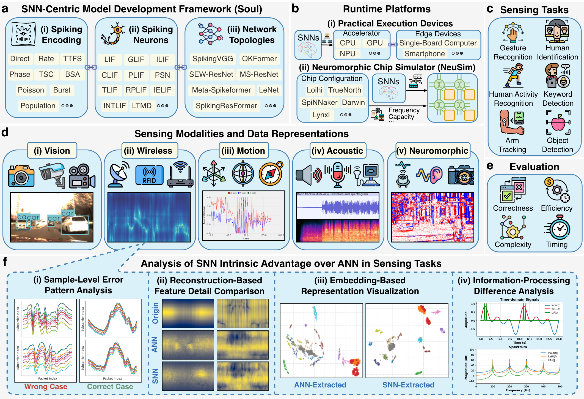
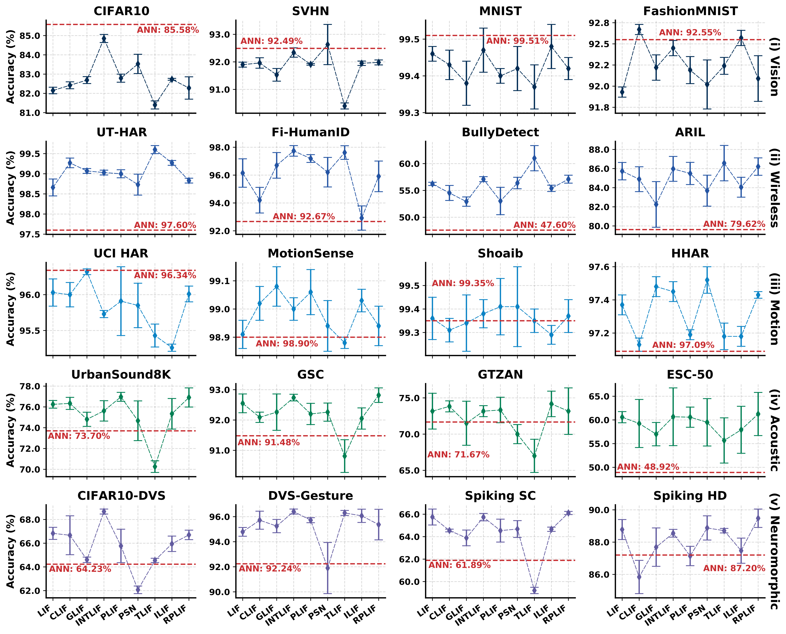
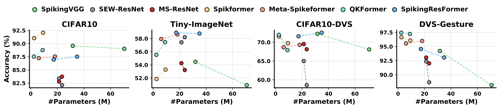
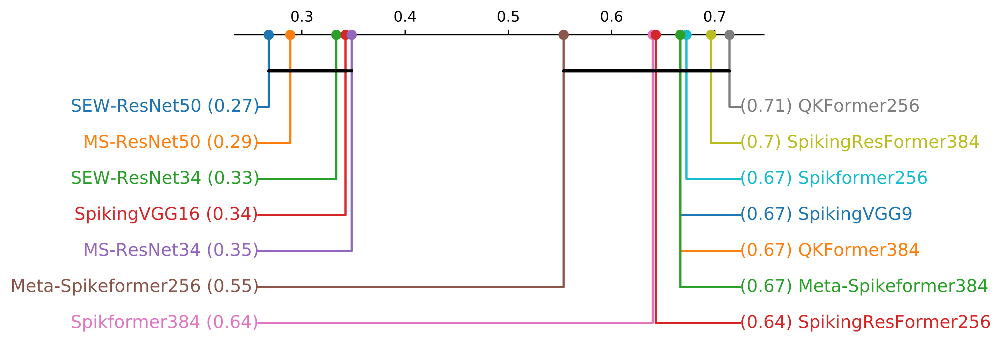
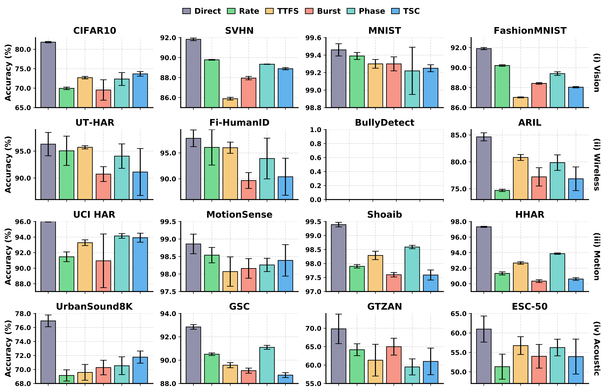

---

<p align="center">
    
</p>

---

*“I have always been convinced that the only way to get artificial intelligence to work is to do the computation in a way similar to the human brain.”——Geoffrey Hinton*

## Overview

Soul is an open-source Python and PyTorch toolkit for building spiking neural network (SNN) applications. It provides a unified, efficient framework designed for both research and edge deployment, enabling you to reproduce brain-inspired computing algorithms and develop new models with minimal overhead. With SOUL (**S**NN-based **O**pen so**U**rce too**L**kit), you can seamlessly experiment with SNNs in a comprehensive environment that bridges academic exploration and real-world edge intelligence.

<p align="center">

</p>

## Usage

You can run the library directly from the command line. For example:

- Run `Soul` on a single GPU (default settings):
    ```shell
    CUDA_VISIBLE_DEVICES=[GPU-ID] python run_soul.py -dataset=[Dataset Name] -data_dir=[Dataset Directory] -T=[Number of timesteps] -m=[Model Name] -n=[Neuron Type]
    ```

- Run `Soul` on multiple GPUs (default settings):
    ```shell
    CUDA_VISIBLE_DEVICES=[GPU-ID1],[GPU-ID2],... torchrun --nproc_per_node=[Number of used GPU] run_soul.py -dataset=[Dataset Name] -data_dir=[Dataset Directory] -T=[Number of timesteps] -m=[Model Name] -n=[Neuron Type]
    ```

If you want to dive deeper into all the available command-line options, configuration settings, and parameters, please check out our [complete documentation](https://soul-docs.readthedocs.io/en/latest/).

## Results

### Performance of LeNet-structured SNNs with different LIF variants

<p align="center">
    
</p>

### Performance of SNNs with different architectures

<p align="center">
    
</p>

<!-- <p align="center">
    
</p> -->

### Performance of SNNs with different input encoding strategies

<p align="center">
    
</p>

## Dataset Support

For each dataset, we provide both a **Research/Reference Link** (to a paper or dataset description) and a **Download Link** to facilitate integration with the toolkit.

<details>
  <summary><b>Vision Sensing</b></summary>
    
| Dataset | Description | Research Link | Download Link |
|:---------:|:-------------:|:--------------:|:--------------:|
| CIFAR-10 / CIFAR-100 | Standard small-image classification benchmarks | [Paper](https://www.cs.utoronto.ca/~kriz/learning-features-2009-TR.pdf) | [Download](https://www.cs.toronto.edu/~kriz/cifar.html) |
| SVHN | Street View House Numbers dataset for digit recognition | [Paper](https://static.googleusercontent.com/media/research.google.com/en//pubs/archive/37648.pdf) | [Download](http://ufldl.stanford.edu/housenumbers/) |
| Tiny-ImageNet | Scaled-down version of ImageNet (200 classes, 64×64 images) | [Paper](https://ieeexplore.ieee.org/abstract/document/5206848/) | [Download](https://www.kaggle.com/c/tiny-imagenet) |
| MNIST | Handwritten digit recognition benchmark | [Dataset](http://yann.lecun.com/exdb/mnist/) | [Download](https://www.kaggle.com/datasets/hojjatk/mnist-dataset) |
| Fashion-MNIST | Drop-in replacement for MNIST with fashion items | [Paper](https://arxiv.org/abs/1708.07747) | [Download](https://github.com/zalandoresearch/fashion-mnist) |

</details>

<details>
  <summary><b>Motion Sensing</b></summary>

| Dataset | Description | Research Link | Download Link |
|:---------:|:-------------:|:--------------:|:--------------:|
| **UCI HAR** | Smartphone-sensor human activity recognition | [Paper](https://www.sciencedirect.com/science/article/abs/pii/S0925231215010930) | [Download](https://archive.ics.uci.edu/dataset/240/human+activity+recognition+using+smartphones) |
| **HHAR** | Heterogeneity human activity recognition (phone sensors) | [Paper](https://dl.acm.org/doi/10.1145/2809695.2809718) | [Download](https://archive.ics.uci.edu/dataset/344/heterogeneity+activity+recognition) |
| **MotionSense** | iPhone/AppleWatch sensor data for multiple activities | [Paper](https://dl.acm.org/doi/10.1145/3302505.3310068) | [Download](https://www.kaggle.com/datasets/malekzadeh/motionsense-dataset) |
| **Shoaib** | Accelerometer/gyroscope data for activity recognition | [Paper](https://www.mdpi.com/1424-8220/14/6/10146) | [Download](https://www.researchgate.net/publication/266384007_Sensors_Activity_Recognition_DataSet) |

</details>

<details>
  <summary><b>Acoustic Sensing  </b></summary>

| Dataset | Description | Research Link | Download Link |
|:---------:|:-------------:|:--------------:|:--------------:|
| **UrbanSound8K** | Urban sounds classification, 10 classes | [Paper](https://dl.acm.org/doi/10.1145/2647868.2655045) | [Download](https://urbansounddataset.weebly.com/download-urbansound8k.html) |
| **GSC** | Short spoken-words dataset for keyword recognition | [Paper](https://arxiv.org/abs/1804.03209) | [Download](https://huggingface.co/datasets/google/speech_commands) |
| **GTZAN** | Music-genre classification across 10 genres | [Paper](https://ieeexplore.ieee.org/abstract/document/1021072) | [Download](https://www.kaggle.com/datasets/andradaolteanu/gtzan-dataset-music-genre-classification) |
| **ESC-50** | 50 classes environmental sound classification | [Paper](https://dl.acm.org/doi/abs/10.1145/2733373.2806390) | [Download](https://github.com/karoldvl/ESC-50/archive/master.zip) |

</details>

<details>
  <summary><b>Wireless Sensing  </b></summary>
 
| Dataset | Description | Research Link | Download Link |
|:---------:|:-------------:|:--------------:|:--------------:|
| **UT-HAR** | WiFi-CSI human activity recognition | [Paper](https://ieeexplore.ieee.org/document/8067693) | [Download](https://github.com/ermongroup/Wifi_Activity_Recognition?tab=readme-ov-file) |
| **NTU-HumanID** | Device-free human gait identification via WiFi | [Paper](https://ieeexplore.ieee.org/abstract/document/9726794) | [Download](https://drive.google.com/drive/folders/1R0R8SlVbLI1iUFQCzh_mH90H_4CW2iwt) |
| **BullyDetect** | Wireless sensing dataset for bullying-incident detection | [Paper](https://ieeexplore.ieee.org/abstract/document/10734315) | [Download](http://www.sdp8.net/Dataset?id=5ab0f5fd-a678-400a-afb2-757b2d85bc68) |
| **ARIL** | WiFi-reflection human-action recognition dataset | [Paper](https://arxiv.org/pdf/1904.04964) | [Download](http://www.sdp8.net/Dataset?id=9d263468-4869-4dbb-85aa-2c63ba0a1e0f) |
| **NTU-HAR** | Wi-Fi CSI-based human activity recognition | [Paper](https://ieeexplore.ieee.org/document/9667414) | [Download](https://drive.google.com/drive/folders/1R0R8SlVbLI1iUFQCzh_mH90H_4CW2iwt) |
| **Widar 3.0** | Wi-Fi-based gesture recognition using Body-coordinate Velocity Profile (BVP) and CSI/DFS | [Paper](https://ieeexplore.ieee.org/document/9516988) | [Download](https://tns.thss.tsinghua.edu.cn/widar3.0/) |

</details>

<details>
  <summary><b>Neuromorphic Sensing  </b></summary>

| Dataset | Description | Research Link | Download Link |
|:---------:|:-------------:|:--------------:|:--------------:|
| **CIFAR10-DVS** | Event-based version of CIFAR-10 captured with DVS sensor | [Paper](https://www.frontiersin.org/journals/neuroscience/articles/10.3389/fnins.2017.00309/full) | [Download](https://figshare.com/articles/dataset/CIFAR10-DVS_New/4724671) |
| **DVS-Gesture** | Dynamic Vision Sensor dataset for gesture recognition | [Paper](https://ieeexplore.ieee.org/document/8100264) | [Download](https://ibm.ent.box.com/s/3hiq58ww1pbbjrinh367ykfdf60xsfm8/folder/50167556794) |
| **SHD** | Event-based audio dataset for digit recognition | [Paper](https://ieeexplore.ieee.org/document/9311226) | [Download](https://zenkelab.org/resources/spiking-heidelberg-datasets-shd/) |
| **SSC** | Event-based speech commands dataset | [Paper](https://ieeexplore.ieee.org/document/9311226) | [Download](https://zenkelab.org/resources/spiking-heidelberg-datasets-shd/) |

</details>


> **Note:** After downloading and extracting the datasets, you only need to point the `data_dir` argument to the root directory of the dataset in your configuration (or command-line). The SOUL toolkit will automatically process the data in that directory and run accordingly.


## Cite

```
TBD
```

## Contact Us

If there are any questions, please feel free to propose new features by opening an issue or contacting the author: **Di Yu**([yudi2023@zju.edu.cn](mailto:yudi2023@zju.edu.cn)), **Changze Lv**([czlv24@m.fudan.edu.cn](mailto:czlv24@m.fudan.edu.cn)), **Zhuo Chen**([chenzhuocs@zju.edu.cn](mailto:chenzhuocs@zju.edu.cn)), and **Wentao Tong**([toldzera@zju.edu.cn](mailto:toldzera@zju.edu.cn)).

Enjoy the code!

## TODO List

- [x] 2026.1.4-2026.1.6 ~~收尾latency统计脚本，准备好OPs理论能耗脚本 @余帝~~
- [ ] 2026.1.4-2026.2.1 收尾附录详情 @余帝
- [x] 2026.1.4-2026.1.7 ~~定稿Fig 2 (SNN-bench)正文展示 @余帝~~ (差一个topology的结果，等待补全csv即可彻底完成) 
- [ ] 2026.1.4-2026.1.17 补全Table 1 @余帝 @张炜松
- [x] 2026.1.6-2026.1.9 熟悉使用NeuSim做推理，并成功运行结果 @张炜松 @郑赫霖 @陈卓
- [ ] ~~2026.1.6-2026.1.9 熟悉使用Darwin片上推理操作，并成功运行结果 (杜老师说可能不需要) @张炜松 @郑赫霖 @童文韬~~
- [ ] 2026.1.9-2026.1.20 完成三种延迟结果统计（真实+理论），理论推理能耗统计 @郑赫霖 @张炜松 @陈卓 @童文韬
- [x] 2026.1.10-2026.1.12 定稿Fig 5 (Soul-NeuSim推广展望)正文展示 @余帝 @陈卓
- [ ] 2026.1.20-2026.1.24 定稿Fig 4 (latency-energy)正文展示 @余帝
- [ ] 2026.1.21-2026.1.31 收尾Soul-Doc的内容并合并到main分支准备发布  @郑赫霖 @张炜松 
- [ ] 2026.1.21-2026.1.31 协助补全Soul项目内的各文件Reference Comment  @郑赫霖 @张炜松 有任何疑问找@余帝
- [ ] 2026.1.24-2026.1.31 若latency、energy的相关结果均完成，在此基础上提交NeuSim分支合并申请 @陈卓
- [ ] 2026.1.24-2026.2.1 补全子刊中wireless CSI频率适配相关理论以及Fig 3(各种分析图)正文展示 @廖振宇 @余帝
- [ ] 2026.2.1-2026.2.14 收尾正文内容 @杜老师 @余帝
- [ ] 2026.1.26-2026.1.27 给一个输入图片输出热力图的代码接口，用作Fig3的补充 @童文韬
- [ ] 2026.1.30-2027.2.14 新增2个神经元 [PMSN（nips'25）](https://github.com/PengXue0812/Multiplication-Free-Parallelizable-Spiking-Neurons-with-Efficient-Spatio-Temporal-Dynamics),[HetSynLIF (nips'25)](https://github.com/dzcgood/HetSyn)，然后把SJ的izhkevich和HH也给融进来，用来对标step @吕昌泽
- [ ] 2026.1.30-2027.2.14 check下intlif和NI-LIF，我感觉我们实现的是aaai的NI-LIF,INTLIF应该是前面ECCV的文章 @吕昌泽
